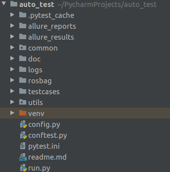

# AUTOCORE自动化测试
框架： pytest+allure

#python版本
    Ubuntu自带的Python3.6
    安装pip: sudo apt install python3-pip
#安装JDK
```
sudo apt-get update
sudo apt-get install openjdk-8-jdk
sudo update-alternatives --set java /usr/lib/jvm/jdk1.8.0_version/bin/java  # 设置环境变量
java -version  # 显示版本信息表示安装成功
```
  
# 安装Allure
sudo apt-get update 
sudo apt-get install allure

# python 模块安装
```
pip install pytest
pip install allure-pytest
pip install pytest-assume  # assert 失败还继续进行
```

# 自动化测试目录说明

1. testcases -- 测试用例
2. allure_results -- 测试结果
3. allire_reports -- 测试报告
4. .pytest_cache -- 本次测试的执行状态
5. common -- 封装的公共方法
6. doc -- 测试文档，可存放某些详细的说明
7. logs -- 本次执行的测试日志
9. rosbag -- 测试用到的rosbag包
10. utils -- 封装的常用工具
11. venv -- 虚拟环境
12. config.py -- 测试配置
13. conftest.py -- 最顶成的测试固件
14. pytest.ini -- pytest配置
15. run.py -- 执行测试用例脚本

# 插件
1. pytest-repeat 重复执行
2. pytest-rerunfailures 失败用例再执行
3. pytest-assume 多重断言  前边的断言失败后，后边的断言还会继续执行，有助于分析那些断言失败，比原有的更高级
4. pytest-xdist 分布式执行用例，节省时间，属于进程级别的并发
5. allure-pytest 生成十分完美的测试报告，allure serve ./report/xml 
    Overview：总览
    Categories：类别，默认是分了failed和error，凡是执行结果是其中一个的都会被归到类里面，可以通过这里快捷查看哪些用例是failed和error的
    Suites：测试套件，就是所有用例的层级关系，可以根据package、module、类、方法来查找用例
    Graphs：测试结果图形化，包括用例执行结果的分布图，优先级，耗时等
    Timeline：可以看到测试用例精确的测试时序（执行顺序），包括执行时间
    Behaviors：行为驱动，根据epic、feature、story来分组测试用例（后面会讲到）
    Packages：这就是按照package、module来分组测试用例了

# 框架学习

pytest官网： https://docs.pytest.org/en/stable/

https://www.cnblogs.com/poloyy/tag/Pytest/

https://www.cnblogs.com/luizyao/tag/pytest/

allure官网： https://docs.qameta.io/allure/

https://www.cnblogs.com/linuxchao/p/linuxchao-pytest-allure.html
